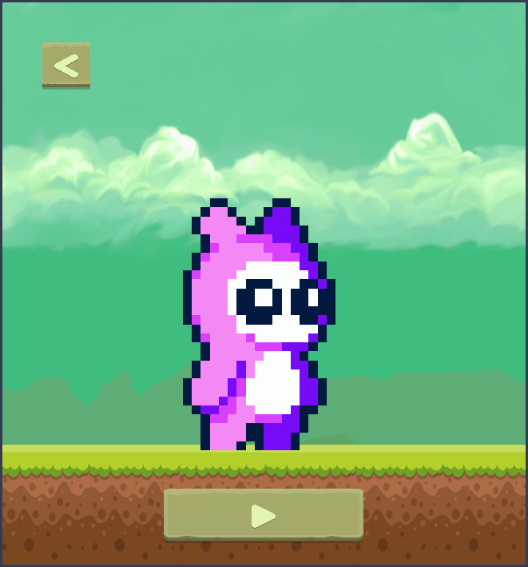

# 🏃‍♂️ BraveRunner: My Very First Game

<div align="center">

[](https://abhishek-m-raj.github.io/braverunner/)
[](https://www.python.org/)
[](https://pyga.me/)
[](https://github.com/pygame-web/pygbag)

<br />



<br />

### 🎮 **[👉 Play BraveRunner Online in Your Browser 👈](https://abhishek-m-raj.github.io/braverunner/)**

</div>

---

## 🌐 Live Demo

Play **BraveRunner** directly in your web browser powered by WebAssembly and Pygbag:

👉 **[Play BraveRunner Online](https://abhishek-m-raj.github.io/braverunner/)**

---

## 📖 The Story Behind the Code

Welcome to a literal time capsule! This repository holds **BraveRunner**, my very first coding project. 

I built this 2D platformer using Python and Pygame when I was just 13 years old. Long before I knew what clean code or proper software architecture was, I was just a kid furiously typing away, trying to build my own indie game from scratch.

Back then, I was learning Python purely through YouTube tutorials—huge shoutout to *Tech With Tim*. I was also super inspired by *DaFluffyPotato*, to the point where I became obsessed with the 2D water physics in his games. Trying to replicate that fluid 2D water physics in Python drove me absolutely crazy and took ages to figure out!

Like most 13-year-old devs, I grabbed whatever art and sound effects I could find online. Because I absolutely loved *Pirates of the Caribbean*, I proudly slapped "He's a Pirate" into the game as the main theme song. It didn't quite fit a platformer, but I loved it anyway!

---

## 💔 Lost... and Found

I didn't know what Git or GitHub was back then. Version control was completely alien to me. So, when my old, struggling "potato PC" finally gave up and broke down, I thought I had lost *BraveRunner* forever. 

Fast forward to recently: I was randomly digging through an old Google Drive backup `.zip` file when, to my absolute shock, I found the project folder sitting right there. Booting it up gave me the craziest wave of nostalgia.

<div align="center">
  <video src="screenshots/old.mp4" controls="controls" width="720" style="max-width:100%;"></video>
  <br />
  <sub>📹 <i>Gameplay footage with code recovered from the Google Drive backup zip</i></sub>
</div>

<br />

When I recovered the game, it was exactly as a beginner's first project should be: ambitious, clunky, and filled with learning experiences:
* **The Code:** I had very little grasp of Object-Oriented Programming (OOP). The codebase was a mess, with massive single files holding way too many lines of code.
* **The Camera & Layout:** During early development, the map was built starting lower on the screen so vertical scrolling wasn't an issue at first, making vertical camera adjustments simple to fix later on.
* **The Real Challenge:** The water physics was the main beast that took countless hours to tweak and get working right.
* **The Dead End:** I originally abandoned it because I desperately wanted *BraveRunner* to be a mobile game. But trying to compile Pygame to an APK back then meant relying on ancient tutorials. It was nearly impossible, so I gave up.

---

## 🛠️ The Glow-Up (Refurbishing the Game)

I couldn't just leave my childhood project sitting there broken. Once I got it back, I spent some time fixing it up:

* 🎥 **Camera & Map Polish:** Adjusted vertical tracking and level layouts for smooth platforming.
* 🌊 **Refined Physics:** Cleaned up player movement and water interaction logic.
* 👾 **Added Enemies:** The original game was pretty lonely. Now there's actual danger and entity collisions.
* 🏆 **Game Logic:** Implemented actual win, loss, and game-over states with save management.
* 🧹 **Cleaned Code:** Refactored the giant spaghetti-code files into modular entity, system, and state modules.
* 🌐 **Web Deployment:** Now you can play BraveRunner directly in your browser via Pygbag & GitHub Pages!

---

## 🎮 Game Controls

| Key / Action | In-Game Action |
| :--- | :--- |
| **`Left Arrow`** | Move Left |
| **`Right Arrow`** | Move Right |
| **`Space`** / **`Up Arrow`** | Jump (Supports Double Jump! 🦘) |

---

## 🚀 How to Run Locally

### Prerequisites
- Python 3.10 or higher installed.

### Installation Steps

1. **Clone the repository:**
   ```bash
   git clone https://github.com/abhishek-m-raj/braverunner.git
   cd braverunner
   ```

2. **Create and activate a virtual environment:**
   ```bash
   python -m venv venv
   source venv/bin/activate  # Windows: venv\Scripts\activate
   ```

3. **Install dependencies:**
   ```bash
   pip install -r requirements.txt
   ```

4. **Run the game:**
   ```bash
   python main.py
   ```

### 🌐 Local Web Server (Pygbag)
To build and test the WebAssembly web version locally:
```bash
pip install pygbag
python -m pygbag .
```

---

## ⚙️ Tech Stack

- **Language:** Python 3.11+
- **Game Framework:** [Pygame-CE](https://pyga.me/) (Community Edition)
- **Map Loader:** [PyTMX](https://github.com/bitcraft/PyTMX)
- **Web Export:** [Pygbag](https://github.com/pygame-web/pygbag) (WebAssembly / WebGL)

---

## 🌱 Looking Back

*BraveRunner* is far from a perfect game, but it’s a perfect reminder of where I started. Building this taught me the raw fundamentals of Python, game loops, and logic. It’s clunky, it’s nostalgic, and I’m so happy I found that random `.zip` file to bring it back to life.

---

<div align="center">
  <sub>Built with ❤️ by <a href="https://github.com/abhishek-m-raj">Abhishek M Raj</a></sub>
</div>
